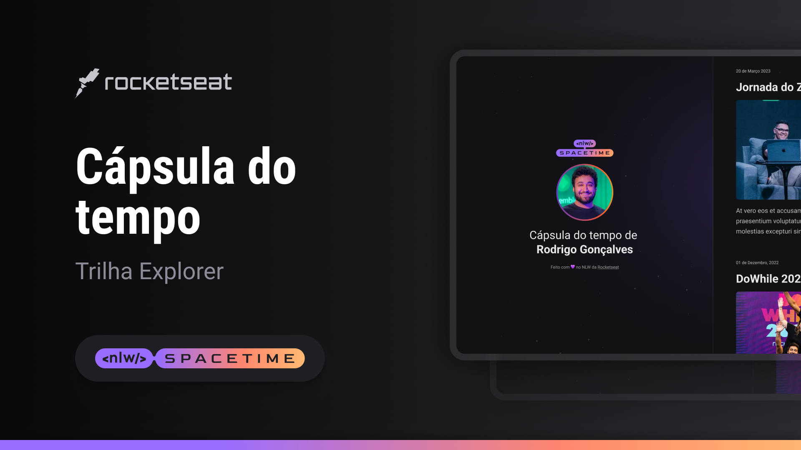

 

<h1 align="center">Projeto CONCLUIDO ✅</h1>
## 💻 Projeto 

Esse é um projeto Web Responsivo de uma capsula do tempo, para exibir memórias em uma linha do tempo.
This is a Time Capsule Responsive Web Design to display memories on a timeline.

## 🚀 Tecnologias

Este projeto foi desenvolvido durante o Rocketseat NLW com as seguintes tecnologias.
This project was developed during Rocketseat NLW with the following technologies.

## 🎟Layout

Você pode visualizar o layout do projeto através [desse link](https://www.figma.com/file/ido6FTtvlJnDoTU4ZOAs8F/C%C3%A1psula-do-tempo-%E2%80%A2-Trilha-Explorer-(Community)-(Copy)?type=design&node-id=306%3A3&t=ZXWX7UIzdkyyIgx1-1).
É necessário ter uma conta no [Figma](https://www.figma.com)

### 👨🏿‍💻 Developer 

Desenvolvido com 💜 Entre emcontato!👋🏿

      <a href="https://www.linkedin.com/in/donizeti-neves-a666b31b0/" > 
